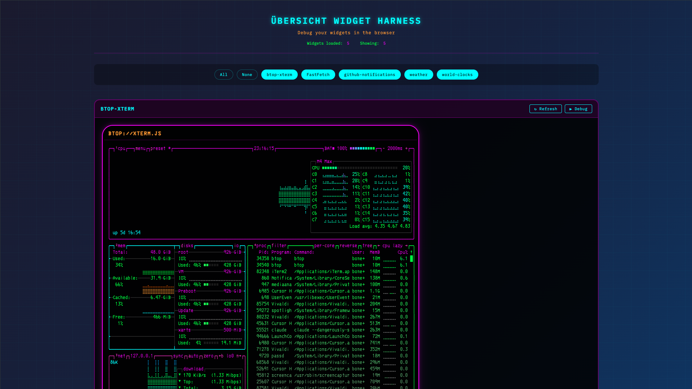

# Übersicht Harness

> A development/testing harness for [Übersicht](http://tracesof.net/uebersicht/) widgets. Run & debug your widgets in a browser with hot reload!



## Quick Start

```bash
npx uebersicht-harness
```

Or install globally:

```bash
npm install -g uebersicht-harness
uebersicht-harness
```

## Configuration

### Widgets Directory

By default, widgets are loaded from `~/Library/Application Support/Übersicht/widgets`.

Override with the `UEBERSICHT_WIDGETS_DIR` environment variable:

```bash
UEBERSICHT_WIDGETS_DIR=/path/to/widgets npx uebersicht-harness
```

### Widget Requirements

Widgets must have an `index.jsx` entry point. Directories starting with `_` or `.` are ignored.

CoffeeScript-based widgets are unsupported.

### CORS Proxy

Übersicht is a desktop app without browser security restrictions. Widgets can freely `fetch()` from `localhost:8080`, `localhost:3000`, etc. In this browser-based harness, those requests would normally be blocked by CORS.

The harness automatically intercepts `fetch()` calls to `localhost` and routes them through Vite's proxy server, bypassing CORS. This works out of the box for common ports: 3000, 4000, 5000, 8000, 8080, 9000.

To add additional ports:

```bash
UEBERSICHT_PROXY_PORTS=3000,8080,12345 npx uebersicht-harness
```

## License

Copyright © 2025 [Christopher "boneskull" Hiller](https://github.com/boneskull). Licensed Blue Oak Model License 1.0.0.
